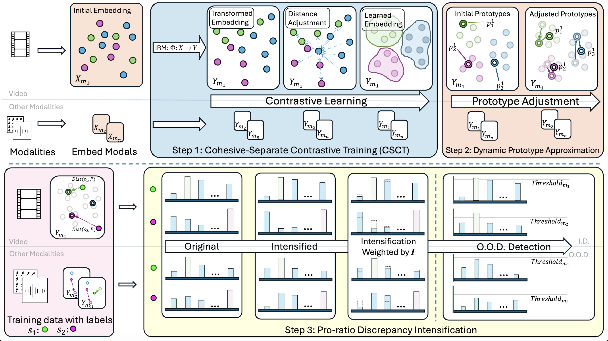

<h1>DPU: Dynamic Prototype Updating for Multimodal OOD Detection</h1>

We follow the data preparing process of [MultiOOD](https://github.com/donghao51/MultiOOD/tree/main?tab=readme-ov-file).

### Prepare Datasets
1. Download HMDB51 video data from [link](https://serre-lab.clps.brown.edu/resource/hmdb-a-large-human-motion-database/#Downloads) and extract. Download HMDB51 optical flow data from [link](https://huggingface.co/datasets/hdong51/MultiOOD/blob/main/hmdb51_flow_mp4.tar.gz) and extract. The directory structure should be modified to match:
<details>
<summary>Click for details...</summary>


```
HMDB51
├── video
|   ├── catch
|   |   ├── *.avi
|   ├── climb
|   |   ├── *.avi
|   |── ...


├── flow
|   ├── *_flow_x.mp4
|   ├── *_flow_y.mp4
|   ├── ...
```

</details>

2. Download UCF101 video data from [link](https://www.crcv.ucf.edu/data/UCF101/UCF101.rar) and extract. Download UCF101 optical flow data from [link](https://huggingface.co/datasets/hdong51/MultiOOD/blob/main/ucf101_flow_mp4.tar.gz) and extract. The directory structure should be modified to match:
<details>
<summary>Click for details...</summary>


```
UCF101
├── video
|   ├── *.avi
|   |── ...


├── flow
|   ├── *_flow_x.mp4
|   ├── *_flow_y.mp4
|   ├── ...
```

</details>

3. Download EPIC-Kitchens video and optical flow data by 
```
bash utils/download_epic_script.sh 
```
Download audio data from [link](https://huggingface.co/datasets/hdong51/Human-Animal-Cartoon/blob/main/EPIC-KITCHENS-audio.zip).

Unzip all files and the directory structure should be modified to match:
<details>
<summary>Click for details...</summary>


```
EPIC-KITCHENS
├── rgb
|   ├── train
|   |   ├── D3
|   |   |   ├── P22_05.wav
|   |   |   ├── P22_05
|   |   |   |     ├── frame_0000000000.jpg
|   |   |   |     ├── ...
|   |   |   ├── P22_06
|   |   |   ├── ...
|   ├── test
|   |   ├── D3
|   |   |   ├── P22_01.wav
|   |   |   ├── P22_01
|   |   |   |     ├── frame_0000000000.jpg
|   |   |   |     ├── ...
|   |   |   ├── P22_02
|   |   |   ├── ...

├── flow
|   ├── train
|   |   ├── D3
|   |   |   ├── P22_05
|   |   |   |     ├── frame_0000000000.jpg
|   |   |   |     ├── ...
|   |   |   ├── P22_06
|   |   |   ├── ...
|   ├── test
|   |   ├── D3
|   |   |   ├── P22_01
|   |   |   |     ├── frame_0000000000.jpg
|   |   |   |     ├── ...
|   |   |   ├── P22_02
|   |   |   ├── ...
```

</details>

4. Download HAC video, audio and optical flow data from [link](https://huggingface.co/datasets/hdong51/Human-Animal-Cartoon/tree/main) and extract. The directory structure should be modified to match:
<details>
<summary>Click for details...</summary>


```
HAC
├── human
|   ├── videos
|   |   ├── ...
|   ├── flow
|   |   ├── ...
|   ├── audio
|   |   ├── ...

├── animal
|   ├── videos
|   |   ├── ...
|   ├── flow
|   |   ├── ...
|   ├── audio
|   |   ├── ...

├── cartoon
|   ├── videos
|   |   ├── ...
|   ├── flow
|   |   ├── ...
|   ├── audio
|   |   ├── ...
```

</details>

5. Download Kinetics-600 video data by 
```
wget -i utils/filtered_k600_train_path.txt
```
Extract all files and get audio data from video data by
```
python utils/generate_audio_files.py
```
Download Kinetics-600 optical flow data (kinetics600_flow_mp4_part_*) from [link](https://huggingface.co/datasets/hdong51/MultiOOD/tree/main) and extract (run `cat kinetics600_flow_mp4_part_* > kinetics600_flow_mp4.tar.gz` and then `tar -zxvf kinetics600_flow_mp4.tar.gz`).

Unzip all files and the directory structure should be modified to match:
<details>
<summary>Click for details...</summary>


```
Kinetics-600
├── video
|   ├── acting in play
|   |   ├── *.mp4
|   |   ├── *.wav
|   |── ...


├── flow
|   ├── acting in play
|   |   ├── *_flow_x.mp4
|   |   ├── *_flow_y.mp4
|   ├── ...
```

</details>

### Dataset Splits
The splits for Multimodal Near-OOD and Far-OOD Benchmarks are provided under `HMDB-rgb-flow/splits/` for HMDB51, UCF101, HAC, and Kinetics-600, and under `EPIC-rgb-flow/splits/` for EPIC-Kitchens.


## Methodology


## Code
The code was tested using `Python 3.10.4`, `torch 1.11.0+cu113` and `NVIDIA GeForce RTX 3090`. More dependencies are in `requirement.txt`.

### Prepare

#### Download Pretrained Weights
1. Download SlowFast model for RGB modality [link](https://download.openmmlab.com/mmaction/recognition/slowfast/slowfast_r101_8x8x1_256e_kinetics400_rgb/slowfast_r101_8x8x1_256e_kinetics400_rgb_20210218-0dd54025.pth) and place under the `HMDB-rgb-flow/pretrained_models` and `EPIC-rgb-flow/pretrained_models` directory
   
2. Download SlowOnly model for Flow modality [link](https://download.openmmlab.com/mmaction/recognition/slowonly/slowonly_r50_8x8x1_256e_kinetics400_flow/slowonly_r50_8x8x1_256e_kinetics400_flow_20200704-6b384243.pth) and place under the `HMDB-rgb-flow/pretrained_models` and `EPIC-rgb-flow/pretrained_models` directory

3. Download Audio model [link](http://www.robots.ox.ac.uk/~vgg/data/vggsound/models/H.pth.tar), rename it as `vggsound_avgpool.pth.tar` and place under the `HMDB-rgb-flow/pretrained_models` and `EPIC-rgb-flow/pretrained_models`  directory
   
### Multimodal Near-OOD Detection
#### HMDB51 25/26

<details>
<summary>Click for details...</summary>

```
cd HMDB-rgb-flow/
```

Train the Near-OOD baseline model for HMDB:

```
python train_video_flow.py --near_ood --dataset 'HMDB' --lr 0.0001 --seed 0 --bsz 16 --num_workers 10 --nepochs 50 --appen '' --save_best --save_checkpoint --datapath '/path/to/HMDB51/' 
```

Train the Near-OOD model using DPU for HMDB:

```
python train_video_flow.py --near_ood --dataset 'HMDB' --lr 0.0001 --seed 0 --bsz 64 --num_workers 10 --start_epoch 10 --use_single_pred --use_irm --use_dynamic_a2d --a2d_max_hellinger --a2d_ratio 0.5 --use_npmix --max_ood_hellinger --a2d_ratio_ood 0.5 --ood_entropy_ratio 0.5 --nepochs 50 --appen '' --save_best --save_checkpoint --datapath '/path/to/HMDB51/' 
```

You can also download our provided checkpoints (`HMDB_near_ood_baseline.pt`, `HMDB_near_ood_a2d.pt`, and `HMDB_near_ood_a2d_npmix.pt`) from [link](https://huggingface.co/datasets/hdong51/MultiOOD/tree/main/checkpoints).

Save the evaluation files for HMDB (to save evaluation files for ASH or ReAct, you should also run following line with options `--use_ash` or `--use_react`):
```
python test_video_flow.py --bsz 16 --num_workers 2 --near_ood --dataset 'HMDB' --appen 'a2d_npmix_best_' --resumef '/path/to/HMDB_near_ood_a2d_npmix.pt'
```

Evaluation for HMDB (change `--postprocessor` to different score functions, for VIM you should also pass `--resume_file checkpoint.pt`, where checkpoint.pt is the trained checkpoint):
```
python eval_video_flow_near_ood.py --postprocessor msp --appen 'a2d_npmix_best_' --dataset 'HMDB' --path 'HMDB-rgb-flow/'
```

</details>


#### UCF101 50/51
<details>
<summary>Click for details...</summary>

```
cd HMDB-rgb-flow/
```

Train the Near-OOD baseline model for UCF:

```
python train_video_flow.py --near_ood --dataset 'UCF' --lr 0.0001 --seed 0 --bsz 16 --num_workers 10 --nepochs 50 --appen '' --save_best --save_checkpoint --datapath '/path/to/UCF101/' 
```

Train the Near-OOD model using DPU for UCF:

```
python train_video_flow.py --near_ood --dataset 'UCF' --lr 0.0001 --seed 0 --bsz 64 --num_workers 10 --start_epoch 10 --use_single_pred --use_irm --use_dynamic_a2d --a2d_max_hellinger --a2d_ratio 0.5 --use_npmix --max_ood_hellinger --a2d_ratio_ood 0.5 --ood_entropy_ratio 0.5 --nepochs 50 --appen '' --save_best --save_checkpoint --datapath '/path/to/UCF101/' 
```

You can also download our provided checkpoints from [link](https://drive.google.com/file/d/19XDezC-oIq_a8nmWDWVr16r_gd4Ryw72/view?usp=share_link).

Save the evaluation files for UCF (to save evaluation files for ASH or ReAct, you should also run following line with options `--use_ash` or `--use_react`):
```
python test_video_flow.py --bsz 16 --num_workers 2 --near_ood --dataset 'UCF' --appen 'a2d_npmix_best_' --resumef '/path/to/UCF_near_ood_a2d_npmix.pt'
```

Evaluation for UCF (change `--postprocessor` to different score functions, for VIM you should also pass `--resume_file checkpoint.pt`, where checkpoint.pt is the trained checkpoint):
```
python eval_video_flow_near_ood.py --postprocessor msp --appen 'a2d_npmix_best_' --dataset 'UCF' --path 'HMDB-rgb-flow/'
```

</details>

#### EPIC-Kitchens 4/4
<details>
<summary>Click for details...</summary>

```
cd EPIC-rgb-flow/
```

Train the Near-OOD baseline model for EPIC:

```
python train_video_flow_epic.py --dataset 'EPIC' --lr 0.0001 --seed 0 --bsz 16 --num_workers 10 --nepochs 20 --appen '' --save_best --save_checkpoint --datapath '/path/to/EPIC-Kitchens/' 
```

Train the Near-OOD model using DPU for EPIC:

```
python train_video_flow_epic.py --dataset 'EPIC' --lr 0.0001 --seed 0 --bsz 16 --num_workers 10 --start_epoch 10 --use_single_pred --use_a2d --a2d_max_hellinger --a2d_ratio 0.1 --use_npmix --max_ood_hellinger --a2d_ratio_ood 0.1 --ood_entropy_ratio 0.1 --nepochs 20 --appen '' --save_best --save_checkpoint --datapath '/path/to/EPIC-Kitchens/' 
```

You can also download our provided checkpoints from [link](https://huggingface.co/datasets/hdong51/MultiOOD/tree/main/checkpoints).

Save the evaluation files for EPIC (to save evaluation files for ASH or ReAct, you should also run following line with options `--use_ash` or `--use_react`):
```
python test_video_flow_epic.py --bsz 16 --num_workers 2  --ood_dataset 'EPIC' --appen 'a2d_npmix_best_' --resumef '/path/to/EPIC_near_ood_a2d_npmix.pt'
```

Evaluation for EPIC (change `--postprocessor` to different score functions, for VIM you should also pass `--resume_file checkpoint.pt`, where checkpoint.pt is the trained checkpoint):
```
python eval_video_flow_near_ood.py --postprocessor msp --appen 'a2d_npmix_best_' --dataset 'EPIC' --path 'EPIC-rgb-flow/'
```

</details>

#### Kinetics-600 129/100
<details>
<summary>Click for details...</summary>

```
cd HMDB-rgb-flow/
```

Train the Near-OOD baseline model for Kinetics:

```
python train_video_flow.py --near_ood --dataset 'Kinetics' --lr 0.0001 --seed 0 --bsz 16 --num_workers 10 --nepochs 20 --appen '' --save_best --save_checkpoint --datapath '/path/to/Kinetics-600/' 
```

Train the Near-OOD model using DPU for Kinetics:

```
python train_video_flow.py --near_ood --dataset 'Kinetics' --lr 0.0001 --seed 0 --bsz 64 --num_workers 10 --start_epoch 10 --use_single_pred --use_irm --use_dynamic_a2d --a2d_max_hellinger --a2d_ratio 0.1 --use_npmix --max_ood_hellinger --a2d_ratio_ood 0.1 --ood_entropy_ratio 0.1 --nepochs 20 --appen '' --save_best --save_checkpoint --datapath '/path/to/Kinetics-600/' 
```

You can also download our provided checkpoint from [link](https://drive.google.com/file/d/146110fw645CO1XxhU3xzx1SpOhTqphiI/view?usp=share_link).

Save the evaluation files for Kinetics (to save evaluation files for ASH or ReAct, you should also run following line with options `--use_ash` or `--use_react`):
```
python test_video_flow.py --bsz 16 --num_workers 2 --near_ood --dataset 'Kinetics' --appen 'a2d_npmix_best_' --resumef '/path/to/Kinetics_near_ood_a2d_npmix.pt'
```

Evaluation for Kinetics (change `--postprocessor` to different score functions, for VIM you should also pass `--resume_file checkpoint.pt`, where checkpoint.pt is the trained checkpoint):
```
python eval_video_flow_near_ood.py --postprocessor msp --appen 'a2d_npmix_best_' --dataset 'Kinetics' --path 'HMDB-rgb-flow/'
```

</details>


### Multimodal Far-OOD Benchmark
#### HMDB51 as ID

<details>
<summary>Click for details...</summary>

```
cd HMDB-rgb-flow/
```

Train the Far-OOD baseline model for HMDB:

```
python train_video_flow.py --dataset 'HMDB' --lr 0.0001 --seed 0 --bsz 16 --num_workers 10 --nepochs 50 --appen '' --save_best --save_checkpoint --datapath '/path/to/HMDB51/' 
```

Train the Far-OOD model using DPU for HMDB:

```
python train_video_flow.py --dataset 'HMDB' --lr 0.0001 --seed 0 --bsz 64 --num_workers 10 --start_epoch 10 --use_single_pred --use_irm --use_dynamic_a2d --a2d_max_hellinger --a2d_ratio 0.1 --use_npmix --max_ood_hellinger --a2d_ratio_ood 0.1 --ood_entropy_ratio 0.1 --nepochs 50 --appen '' --save_best --save_checkpoint --datapath '/path/to/HMDB51/' 
```

You can also download our provided checkpoint from [link](https://drive.google.com/file/d/1kh1P4HoSdeDvoor5Or-Gp1nprkRzZPEJ/view?usp=share_link).

Save the evaluation files for HMDB (to save evaluation files for ASH or ReAct, you should also run following line with options `--use_ash` or `--use_react`, same for other datasets):
```
python test_video_flow.py --bsz 16 --num_workers 2 --dataset 'HMDB' --appen 'a2d_npmix_best_' --resumef '/path/to/HMDB_far_ood_a2d_npmix.pt'
```

Save the evaluation files for UCF:
```
python test_video_flow.py --bsz 16 --num_workers 2 --far_ood --dataset 'HMDB' --ood_dataset 'UCF' --appen 'a2d_npmix_best_' --resumef '/path/to/HMDB_far_ood_a2d_npmix.pt'
```

Save the evaluation files for HAC:
```
python test_video_flow.py --bsz 16 --num_workers 2 --far_ood --dataset 'HMDB' --ood_dataset 'HAC' --appen 'a2d_npmix_best_' --resumef '/path/to/HMDB_far_ood_a2d_npmix.pt'
```

Save the evaluation files for Kinetics:
```
python test_video_flow.py --bsz 16 --num_workers 2 --far_ood --dataset 'HMDB' --ood_dataset 'Kinetics' --appen 'a2d_npmix_best_' --resumef '/path/to/HMDB_far_ood_a2d_npmix.pt'
```

Save the evaluation files for EPIC:
```
cd EPIC-rgb-flow/
```
```
python test_video_flow_epic.py --bsz 16 --num_workers 2 --far_ood --dataset 'HMDB' --ood_dataset 'EPIC' --appen 'a2d_npmix_best_' --resumef '/path/to/HMDB_far_ood_a2d_npmix.pt'
```


Evaluation for UCF (change `--postprocessor` to different score functions, for VIM you should also pass `--resume_file checkpoint.pt`, where checkpoint.pt is the trained checkpoint, change `--ood_dataset` to UCF, EPIC, HAC, or Kinetics):
```
python eval_video_flow_far_ood.py --postprocessor msp --appen 'a2d_npmix_best_' --dataset 'HMDB' --ood_dataset 'UCF' --path 'HMDB-rgb-flow/'
```

</details>


#### Kinetics as ID

<details>
<summary>Click for details...</summary>

```
cd HMDB-rgb-flow/
```

Train the Far-OOD baseline model for Kinetics:

```
python train_video_flow.py --dataset 'Kinetics' --lr 0.0001 --seed 0 --bsz 16 --num_workers 10 --nepochs 10 --appen '' --save_best --save_checkpoint --datapath '/path/to/Kinetics-600/' 
```

Train the Far-OOD model using DPU for Kinetics:

```
python train_video_flow.py --dataset 'Kinetics' --lr 0.0001 --seed 0 --bsz 64 --num_workers 10 --start_epoch 3 --use_single_pred --use_irm --use_dynamic_a2d --a2d_max_hellinger --a2d_ratio 0.1 --use_npmix --max_ood_hellinger --a2d_ratio_ood 0.1 --ood_entropy_ratio 0.1 --nepochs 10 --appen '' --save_best --save_checkpoint --datapath '/path/to/Kinetics-600/' 
```

You can also download our provided checkpoint from [link](https://drive.google.com/file/d/1RUJXj7yQuipUjpEOEbIE5D_8Xmd2lblY/view?usp=share_link).

Save the evaluation files for Kinetics (to save evaluation files for ASH or ReAct, you should also run following line with options `--use_ash` or `--use_react`, same for other datasets):
```
python test_video_flow.py --bsz 16 --num_workers 2 --dataset 'Kinetics' --appen 'a2d_npmix_best_' --resumef '/path/to/Kinetics_far_ood_a2d_npmix.pt'
```

Save the evaluation files for HMDB:
```
python test_video_flow.py --bsz 16 --num_workers 2 --far_ood --dataset 'Kinetics' --ood_dataset 'HMDB' --appen 'a2d_npmix_best_' --resumef '/path/to/Kinetics_far_ood_a2d_npmix.pt'
```

Save the evaluation files for UCF:
```
python test_video_flow.py --bsz 16 --num_workers 2 --far_ood --dataset 'Kinetics' --ood_dataset 'UCF' --appen 'a2d_npmix_best_' --resumef '/path/to/Kinetics_far_ood_a2d_npmix.pt'
```

Save the evaluation files for HAC:
```
python test_video_flow.py --bsz 16 --num_workers 2 --far_ood --dataset 'Kinetics' --ood_dataset 'HAC' --appen 'a2d_npmix_best_' --resumef '/path/to/cKinetics_far_ood_a2d_npmix.pt'
```

Save the evaluation files for EPIC:
```
cd EPIC-rgb-flow/
```
```
python test_video_flow_epic.py --bsz 16 --num_workers 2 --far_ood --dataset 'Kinetics' --ood_dataset 'EPIC' --appen 'a2d_npmix_best_' --resumef '/path/to/Kinetics_far_ood_a2d_npmix.pt'
```


Evaluation for UCF (change `--postprocessor` to different score functions, for VIM you should also pass `--resume_file checkpoint.pt`, where checkpoint.pt is the trained checkpoint, change `--ood_dataset` to UCF, EPIC, HAC, or HMDB):
```
python eval_video_flow_far_ood.py --postprocessor msp --appen 'a2d_npmix_best_' --dataset 'Kinetics' --ood_dataset 'UCF' --path 'HMDB-rgb-flow/'
```

</details>

### Multimodal Near-OOD with Video, Audio, and Optical Flow

#### Kinetics-600 129/100
<details>
<summary>Click for details...</summary>

```
cd HMDB-rgb-flow/
```

Train the Near-OOD baseline model for Kinetics:

```
python train_video_flow_audio.py --near_ood --dataset 'Kinetics' --lr 0.0001 --seed 0 --bsz 16 --num_workers 10 --nepochs 20 --appen '' --save_best --save_checkpoint --datapath '/path/to/Kinetics-600/' 
```

Train the Near-OOD model using DPU for Kinetics:

```
python train_video_flow_audio.py --near_ood --dataset 'Kinetics' --lr 0.0001 --seed 0 --bsz 64 --num_workers 10 --start_epoch 10 --use_single_pred --use_irm --use_a2d --a2d_max_hellinger --a2d_ratio 0.5 --use_npmix --max_ood_hellinger --a2d_ratio_ood 0.5 --ood_entropy_ratio 0.5 --nepochs 20 --appen '' --save_best --save_checkpoint --datapath '/path/to/Kinetics-600/' 
```

You can also download our provided checkpoint from [link](https://drive.google.com/file/d/1ATAdnV7eHaP7TIHLKWQw5oLJKM_TKOiz/view?usp=share_link).

Save the evaluation files for Kinetics (to save evaluation files for ASH or ReAct, you should also run following line with options `--use_ash` or `--use_react`):
```
python test_video_flow_audio.py --bsz 16 --num_workers 2 --near_ood --dataset 'Kinetics' --appen 'a2d_npmix_best_' --resumef '/path/to/Kinetics_near_ood_a2d_npmix.pt'
```

Evaluation for Kinetics (change `--postprocessor` to different score functions, for VIM you should also pass `--resume_file checkpoint.pt`, where checkpoint.pt is the trained checkpoint):
```
python eval_video_flow_near_ood.py --postprocessor msp --appen 'vfa_a2d_npmix_best_' --dataset 'Kinetics' --path 'HMDB-rgb-flow/'
```

</details>


## Acknowledgement

Many thanks to the excellent open-source projects [MultiOOD](https://github.com/donghao51/MultiOOD/tree/main?tab=readme-ov-file).
